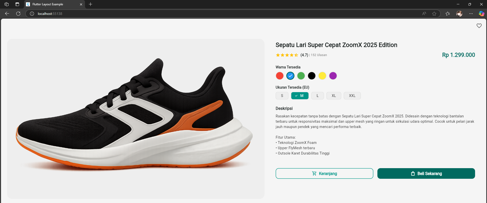

# Tugas Praktikum Pemograman Berbasis Web
## Layout Produk

A new Flutter project.

## Nama dan NPM

| Nama                  | NPM        |
|-----------------------|------------|
| Agil Deriansyah Hasan | 4522210125 |

## Screenshot

## Tujuan Kode
Membuat halaman detail produk pada aplikasi Flutter dengan tampilan responsif dan interaktif, berisi informasi produk, gambar, rating, pilihan warna & ukuran, deskripsi, serta tombol aksi.

## Struktur Umum
Widget utama: StatelessWidget bernama ProductDetailScreen.
Responsif: Gunakan LayoutBuilder → tampilkan NarrowLayout (mobile) atau WideLayout (tablet/web) sesuai lebar layar. 

## Komponen-Komponen Penting
| Komponen | Fungsi | Catatan |
|----------|--------|--------|
| _buildProductImage() |	Menampilkan gambar produk dari folder assets/images | Gunakan AspectRatio dan BoxFit.cover
| _buildRatingStars(double rating)|	Menampilkan bintang rating (penuh/setengah/kosong) |	Dinamis sesuai nilai rating
| _buildOptionsSelector() |	Template untuk menampilkan opsi |	Digunakan untuk warna dan ukuran
| _buildColorOptions()| 	Menampilkan pilihan warna sebagai lingkaran warna |	Saat ini dummy, belum menyimpan pilihan
| _buildSizeOptions()| Menampilkan pilihan ukuran sebagai ChoiceChip	Dummy juga
| _buildProductInfo()| 	Menampilkan teks nama produk, rating, harga, deskripsi, dan pilihan |	Layout rapi dengan Padding dan TextStyle
| _buildActionButtons()| 	Tombol “Tambah ke Keranjang” dan “Beli Sekarang” |	Menggunakan OutlinedButton dan FilledButton

## Layout
build(): Menampilkan tampilan berdasarkan ukuran layar
< 700 px: _buildNarrowLayout() → Gambar di atas, info di bawah
≥ 700 px: _buildWideLayout() → Gambar dan info sejajar (dua kolom)

## Fitur UI
Gunakan ClipRRect untuk membuat gambar dengan sudut membulat.
Ikon favorit (favorite_border) di kanan atas AppBar.
Desain modern, warna, tipografi, dan komponen mengikuti Material 3.
Gambar diberi semanticLabel untuk aksesibilitas.

## Hasil Akhir
Tampilan halaman produk yang:
Informatif
Responsif

## Cara Menjalankan Proyek
1. Jalankan perintah di terminal untuk mengunduh semua package yang diperlukan:
    flutter pub get
2. Pastikan pubspec.yaml Mengatur Asset
   flutter:
   assets:
    - images/
3. Jalankan Aplikasi
   flutter run