# mini_habit_tracker

A new Flutter project.

## Screenshot

### Halaman Utama
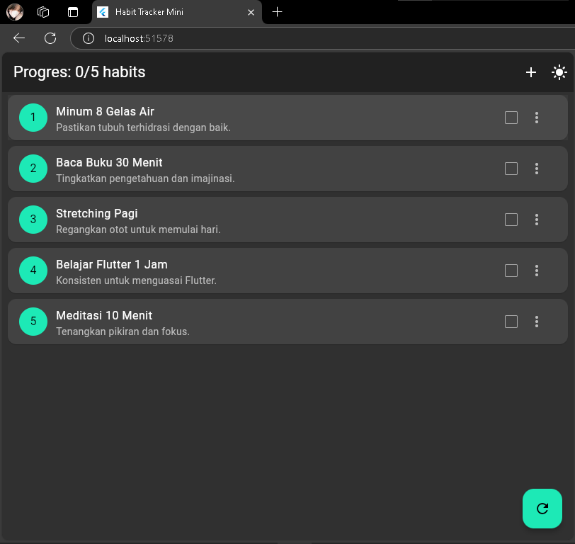

### Uji Strikethrough
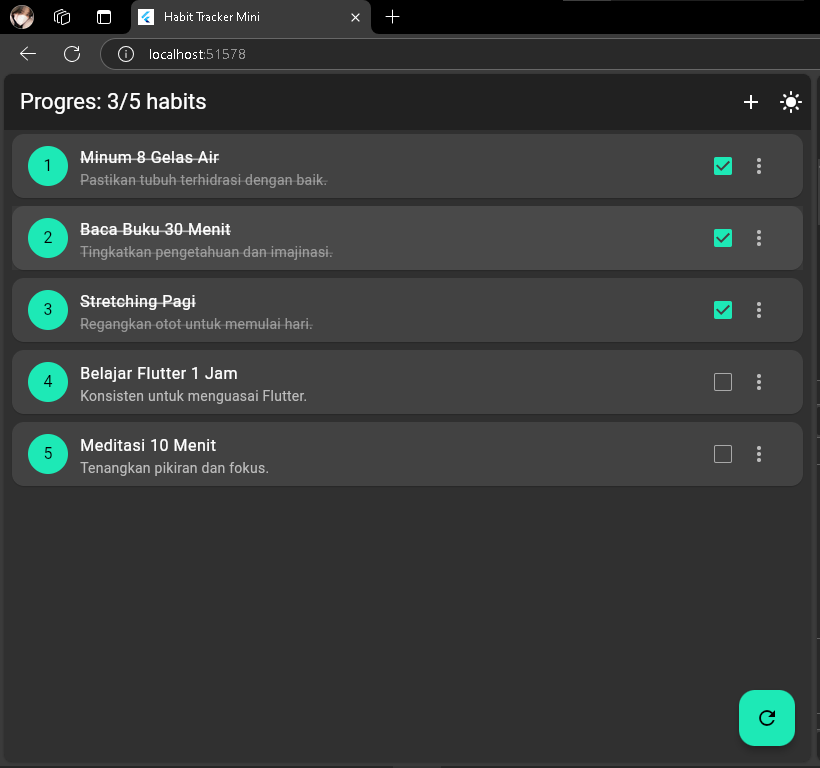

### Uji Tambah Habit

#### Menambahkan Habit
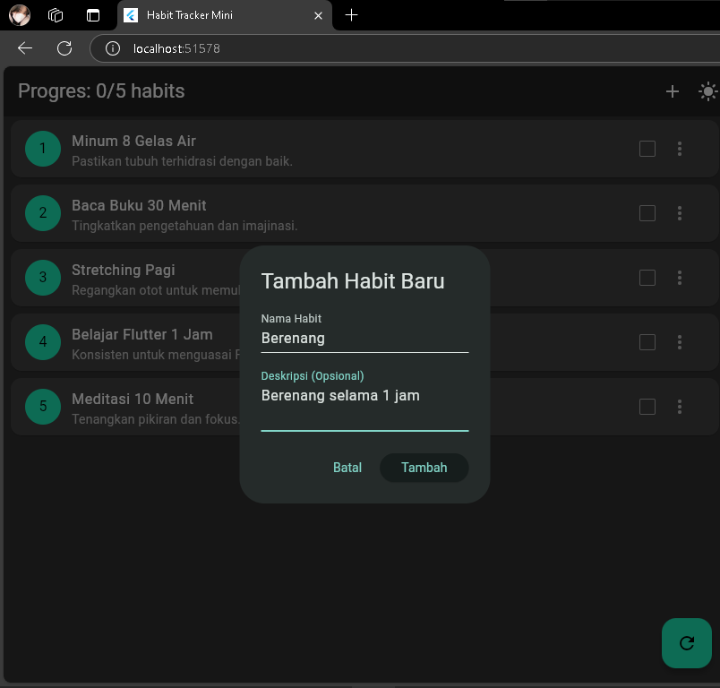

#### Mencoba Menambahkan Habit Tanpa Teks
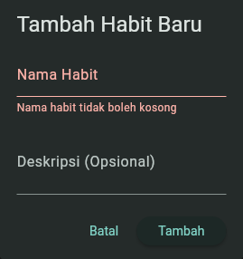

### Tampilan Habit Setelah DiTambahkan
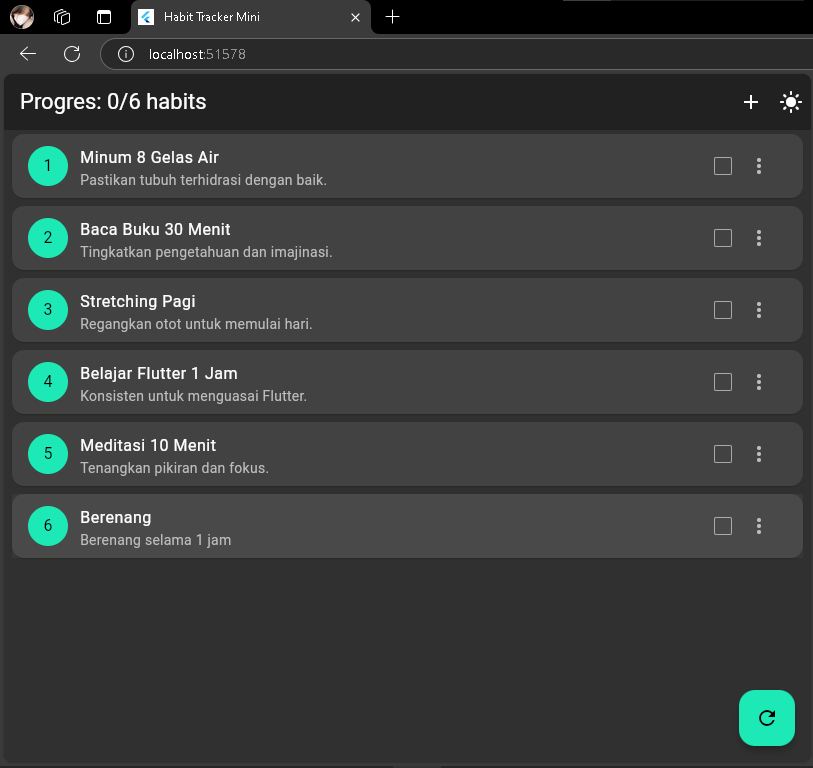

### Uji Edit Habit

#### Mengedit Salah Satu Habit 
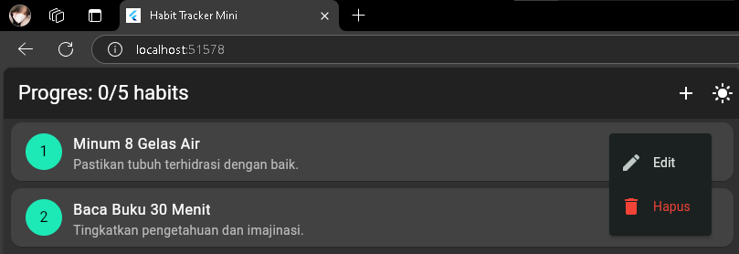 

#### Tampilan Dialog Data Habit
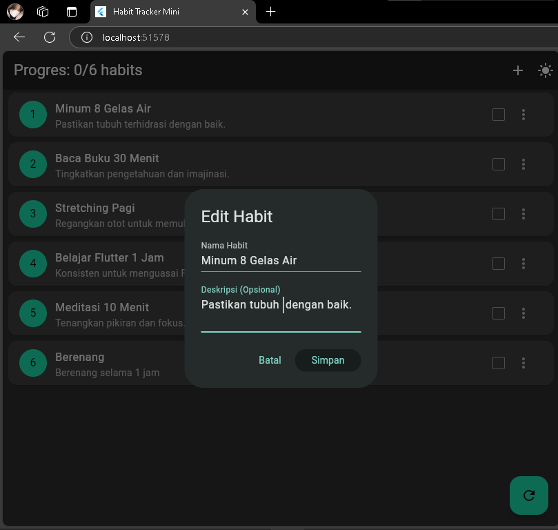
 
#### Tampilan Setelah Mengedit Habit
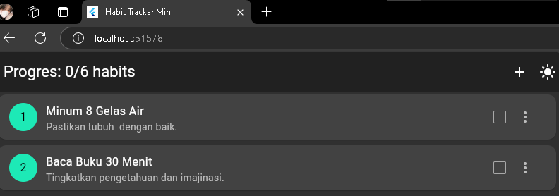

### Uji Hapus Habit

#### Tampilan Tombol Hapus 
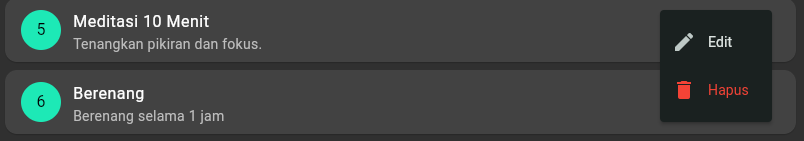

#### Dialog Konfirmasi 
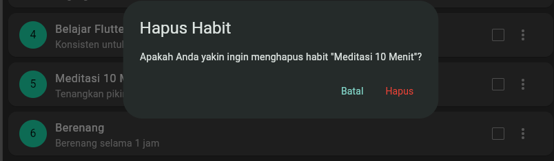

#### Tampilan Habit Setelah Menghapus Salah Satu

### Uji Progress Bar 
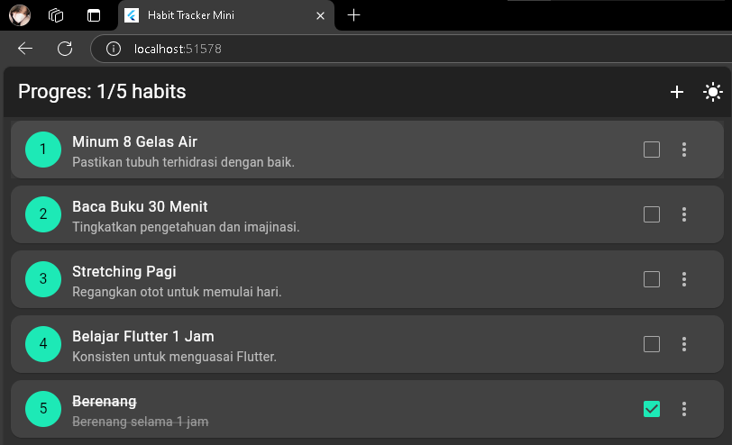

### Uji Reset

#### Sebelum Tombol Reset
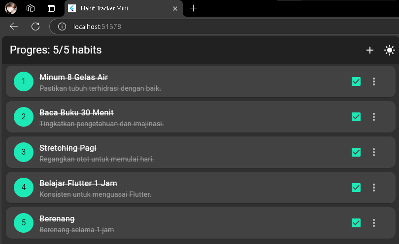

#### Setelah Dipencet Tombol Reset
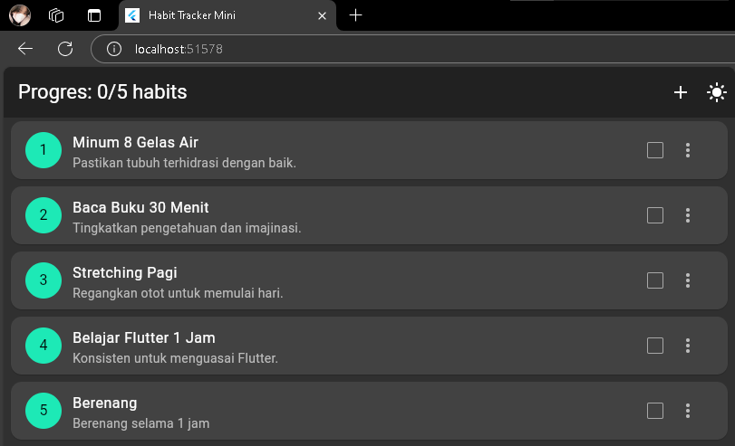

### Uji Ephemeral State

### Amati Output Print
print('build ${habit.name}');
akan muncul di konsol setiap kali build() dipanggil ulang untuk ListView.builder, yaitu saat item-item habit ditampilkan ulang ke layar. Ini artinya log tersebut muncul setiap kali UI yang menampilkan daftar habits dibangun ulang.

#### 1. Menambahkan Habit Baru
- Ketika Anda menekan tombol ➕ (add) lalu menyimpan habit baru, setState akan dipanggil untuk menambahkan habit.
- Ini memicu rebuild.

#### 2. Mengedit Habit 
- Ketika Anda mengedit habit, setState juga dipanggil untuk memperbarui isi habit.
- Maka ListView di-rebuild, dan setiap habit dicetak ulang

#### 3. Menghapus Habit
- Setelah habit dihapus dan setState dipanggil, Flutter akan membangun ulang semua habit yang tersisa.
- Maka log akan muncul ulang untuk semua habit yang masih ada

#### 4. Check/Uncheck
- Ketika Anda menekan checkbox atau tap ListTile (yang toggle status habit), setState dipanggil.
- UI di-rebuild untuk semua item, sehingga akan muncul log build [habit.name] untuk semuanya.