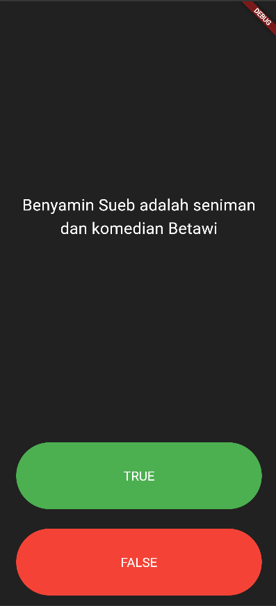
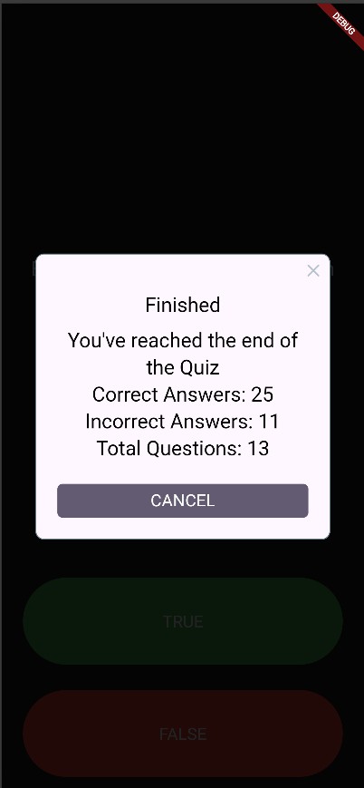

# quizzler

Quizzler flutter app

## Getting Started

Membuat Quiz Benar Salah

Terdiri dari colum 
1. Expanded Pertanyaan
2. Expanded Tombol Benar
3. Exapnded Tombol Salah
4. Row (benar, salah) berupa icons

