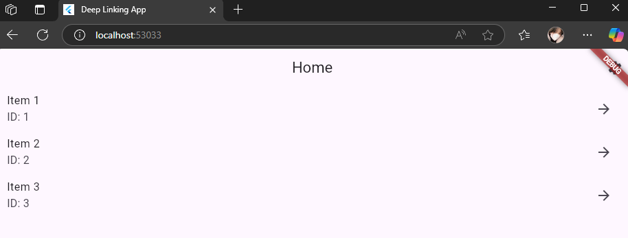
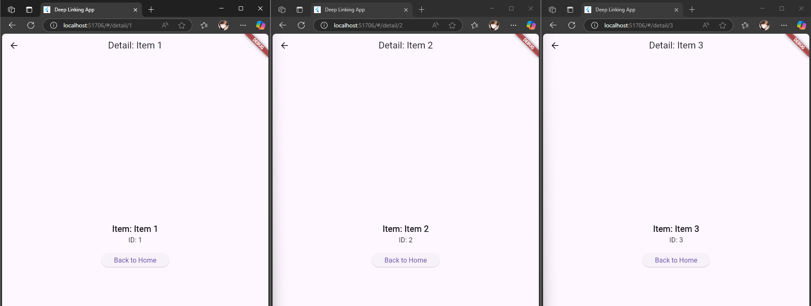
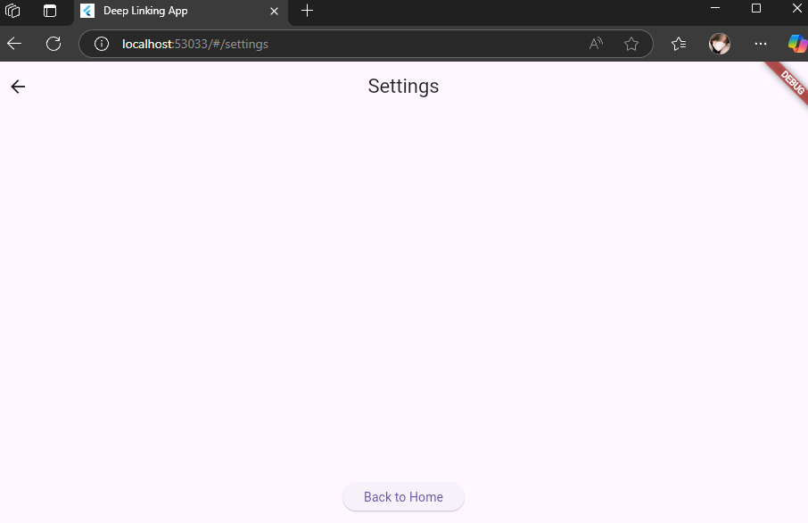

# Deep_Link_Navigation

A new Flutter project.

---

## Nama dan Npm
| Nama                  | NPM        |
|-----------------------|------------|
| Agil Deriansyah Hasan | 4522210125 |

---

## Tujuan

--- 

1. Memahami konsep navigasi tingkat lanjut di Flutter, terutama menggunakan sistem Router API (RouterDelegate dan RouteInformationParser), bukan hanya Navigator.push() yang biasa.
2. Mengimplementasikan deep linking, yaitu kemampuan aplikasi untuk membuka halaman tertentu berdasarkan URL, seperti /detail/1 atau /settings.
3. Mengenal struktur navigasi berbasis deklaratif, yang cocok digunakan untuk aplikasi yang kompleks atau berbasis web.

---

## Gambaran

1. Declarative Navigation (Router API)
   - Menggunakan RouterDelegate dan RouteInformationParser.
   - Routing dideklarasikan berdasarkan state aplikasi.
    Contoh: Jika selectedItemId != null, tampilkan DetailScreen.

2. Deep Link Navigation
   - Aplikasi dapat dibuka melalui URL seperti:
     -  / ➝ HomeScreen 
     - /detail/1 ➝ DetailScreen untuk item ID 1 
     - /settings ➝ SettingsScreen
   - URL langsung bisa diketik atau diklik dari luar aplikasi (misalnya dari web atau push notification).

3. Stack-Based Page Navigation
   - Halaman ditampilkan di atas stack (tumpukan).
   - Digunakan dalam Navigator → halaman bertumpuk satu sama lain.
   - Contoh:
     - Home ➝ Detail ➝ kembali ke Home 
     - Home ➝ Settings ➝ kembali ke Home

---

## Relasi, Navigasi dan Screenshot
    ### Relasi 
        -   Scaffold → menyusun keseluruhan halaman.
        -   AppBar → menampilkan judul dan tombol Settings.
            -   IconButton → untuk membuka SettingsScreen.
        -   ListView.builder → menampilkan daftar item.
        -   ListTile → setiap item yang bisa diklik menuju Detail.
    
    ### Navigasi 
        - Tap item ➝ DetailScreen
        - Tap ikon Settings ➝ SettingsScreen

    ### Screenshot
    
    *Tombol setting nya diatas kanan

    ### Relasi
        -  Scaffold dengan AppBar dinamis (Item.name)
        - Center + Column → untuk menampilkan isi detail
        - ElevatedButton → untuk kembali ke HomeScreen

    ### Navigasi
        -   Tombol "Back to Home" ➝ kembali ke Home

    ### Screenshot
    
    
