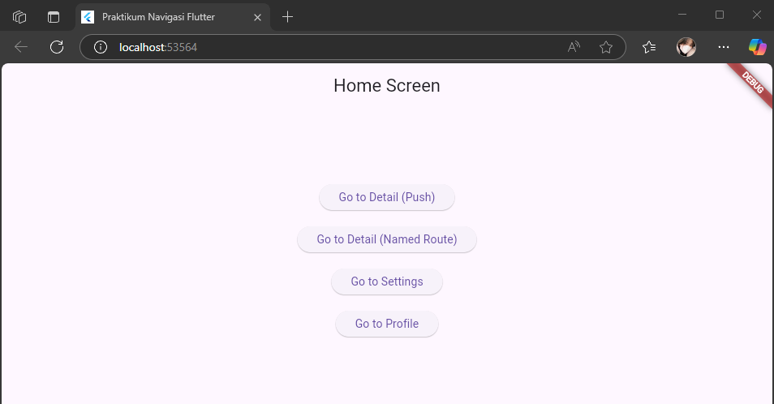
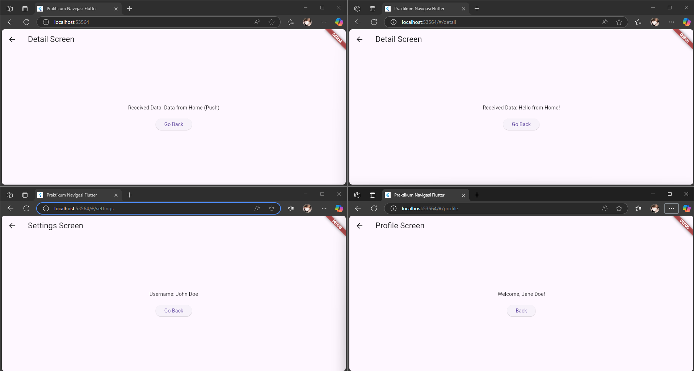

# navigation

A new Flutter project.

## Nama dan NPM

| Nama                  | NPM        |
|-----------------------|------------|
| Agil Deriansyah Hasan | 4522210125 |

---

## 🎯 Tujuan Praktikum
1. Memahami konsep navigasi di Flutter, khususnya:
   -  Navigasi menggunakan Navigator.push (langsung)
   -  Navigasi menggunakan named routes (Navigator.pushNamed)
2. Menampilkan dan mengoper data antar halaman melalui parameter constructor dan arguments.
3. Membuat beberapa layar (screen) seperti Home, Detail, Settings, dan Profile untuk memahami alur berpindah antar halaman di aplikasi.

---

## 🧭 Jenis Navigasi yang Digunakan

| Jenis Navigasi            | Deskripsi                                                                                      |
|--------------------------|------------------------------------------------------------------------------------------------|
| Navigator.push         | Navigasi langsung menggunakan MaterialPageRoute ke screen tertentu.                            |
| Navigator.pushNamed    | Navigasi menggunakan named route (rute bernama) yang didefinisikan di routes pada MaterialApp. |
| Navigator.pop | Kembali ke layar sebelumnya.                                                                   |
| arguments pada Named Route | Mengirim data ke halaman tujuan lewat parameter arguments..                                    |

---

## 📱 Tangkapan Layar & Penjelasan Tampilan

### 1. HomeScreen
  1. Deskripsi:
     - Halaman utama dengan 4 tombol navigasi:
     - Ke DetailScreen (push biasa dan named route)
     - Ke SettingsScreen
     - Ke ProfileScreen

  2. Widget Utama:
     - Scaffold
     - AppBar
     - Column (di dalam Center)
     - ElevatedButton
     - Navigator.push & Navigator.pushNamed

3. Navigasi:
      - Tombol 1: Navigator.push(context, MaterialPageRoute(...))
      - Tombol 2–4: Navigator.pushNamed(context, '/rute', arguments: data)

---

### 2. DetailScreen
1. Deskripsi:
   - Menampilkan teks: "Received Data: ..." dari konstruktor data
   - Tombol kembali ke Home

2. Widget Utama:
  - Scaffold
  - AppBar
  - Text (menampilkan data dari parameter)
  - ElevatedButton
  - Navigator.pop

3. Data Masuk: data via constructor

---

### 3. SettingsScreen
  1. Deskripsi:
     - Menampilkan nama user (username) yang dikirim dari arguments
     - Jika tidak ada data di arguments, gunakan nilai default username (Guest)

  2. Widget Utama:
     - Scaffold
     - AppBar
     - Text
     - ElevatedButton
     - ModalRoute.of(context)?.settings.arguments 
     
  3. Data Masuk: arguments sebagai String

---

### 4. ProfileScreen
  1. Deskripsi:
     - Menampilkan teks: "Welcome, Jane Doe!" atau nama default dari parameter. 
     - Tombol kembali ke Home.

  2. Widget Utama:
     - Scaffold 
     - AppBar 
     - Text 
     - ElevatedButton 
     - ModalRoute.of(context)?.settings.arguments
  
  3. Data Masuk: arguments sebagai String

---

### Home Screen

### Go to Detail  (push), Go to Detail(Named Route), Go to Settings, Go to Profile
