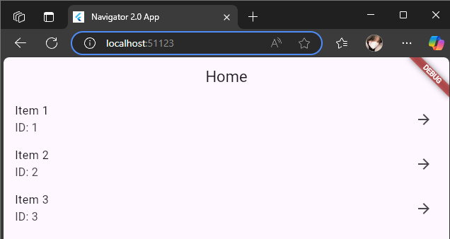
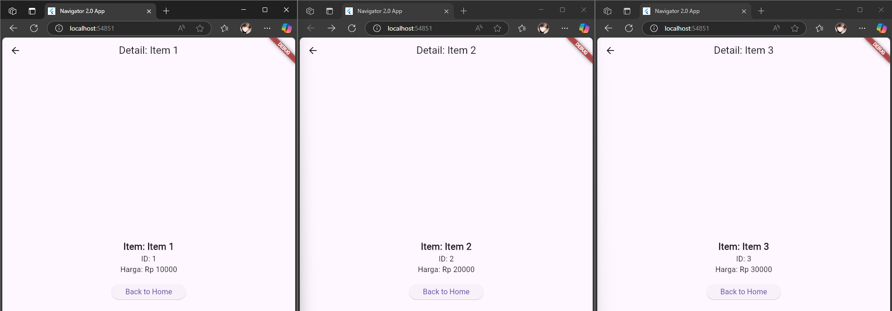

# Navigation_20

A new Flutter project.

## Nama dan NPM

| Nama                  | NPM        |
|-----------------------|------------|
| Agil Deriansyah Hasan | 4522210125 |

---

## 🎯 Tujuan Praktikum
    1. Memahami konsep Navigator 2.0 di Flutter, yang menggunakan pendekatan deklaratif untuk mengelola tampilan halaman (pages).
    2. Mengetahui cara membuat dan berpindah antar layar (screen) tanpa menggunakan Navigator.push atau pushNamed seperti di Navigator 1.0.
    3. Mengelola state navigasi secara eksplisit berdasarkan logika aplikasi (dalam hal ini, apakah item dipilih atau tidak).
    4. Menampilkan data detail dari item yang dipilih, termasuk ID, nama, dan harga, dan kembali ke halaman utama dengan mekanisme onPopPage.

---

## 🧭 Jenis Navigasi yang Digunakan

| Jenis Navigasi            | Deskripsi                                                                                      |
|--------------------------|------------------------------------------------------------------------------------------------|
| Navigator 2.0         | Menggunakan widget Navigator dan pages list untuk menentukan halaman yang muncul berdasarkan kondisi aplikasi.                           |
| Deklaratif    | Tidak menggunakan Navigator.push, melainkan mengganti isi daftar pages. |
| Navigator.pop | Kembali ke layar sebelumnya.                                                                   |
| Pop Handler | Gunakan onPopPage untuk menangani aksi kembali dan mengatur state.                                    |

---

## 📱 Tangkapan Layar & Penjelasan Tampilan

### 1. HomeScreen
    1. Deskripsi:
        Menampilkan daftar item (ListView.builder).
        Setiap item dapat diklik untuk membuka DetailScreen.

    2. Widget yang Berelasi:
        Scaffold: Kerangka halaman.
        AppBar: Judul halaman.
        ListView.builder: Menampilkan daftar item.
        ListTile: Tiap baris item dengan nama dan ID.
        onTap: Memicu fungsi onItemSelected(item) untuk mengubah state _selectedItem, yang memicu tampilan DetailScreen.

---

### 2. DetailScreen
    1. Deskripsi:
        Menampilkan informasi detail dari item yang dipilih: nama, ID, harga.
        Tombol "Back to Home" akan memicu onBack() yang menghapus _selectedItem.

    2. Widget yang Berelasi:
        Scaffold: Struktur halaman.
        AppBar: Menampilkan nama item.
        Text: Menampilkan informasi item.
        ElevatedButton: Tombol kembali memicu fungsi onBack(), yang mengubah state sehingga halaman ini ditutup.

---

### 3. Navigator
    1. Deskripsi:
        Navigasi dikelola melalui daftar pages.
        Jika _selectedItem == null, hanya HomeScreen yang ditampilkan.
        Jika _selectedItem != null, DetailScreen ditambahkan dalam tumpukan halaman.

    2. Widget yang Berelasi:
        Navigator: Widget utama untuk mengelola stack halaman.
        MaterialPage: Representasi setiap halaman (HomeScreen dan DetailScreen) dalam stack.
        onPopPage: Digunakan untuk menangani tombol kembali (back), dan menghapus item yang dipilih.
 
---

### Home Screen

### Penampilan Isi Dari Masing Masing item

