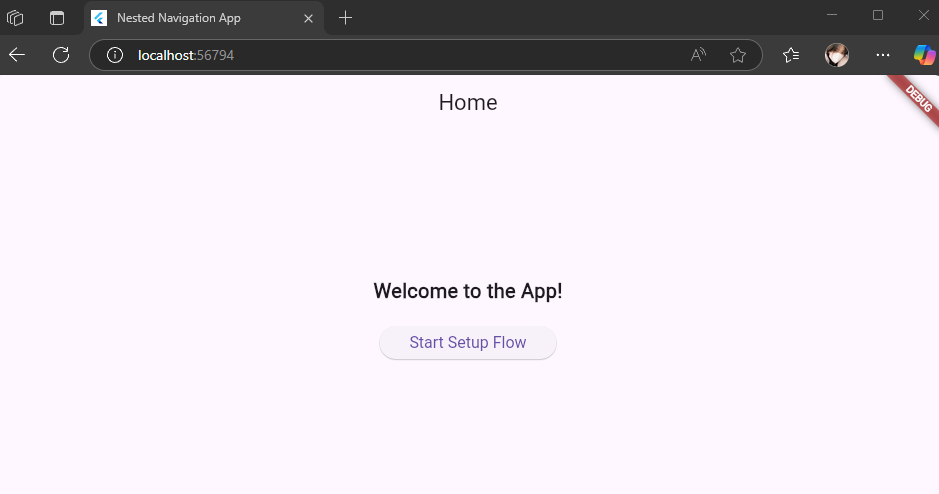
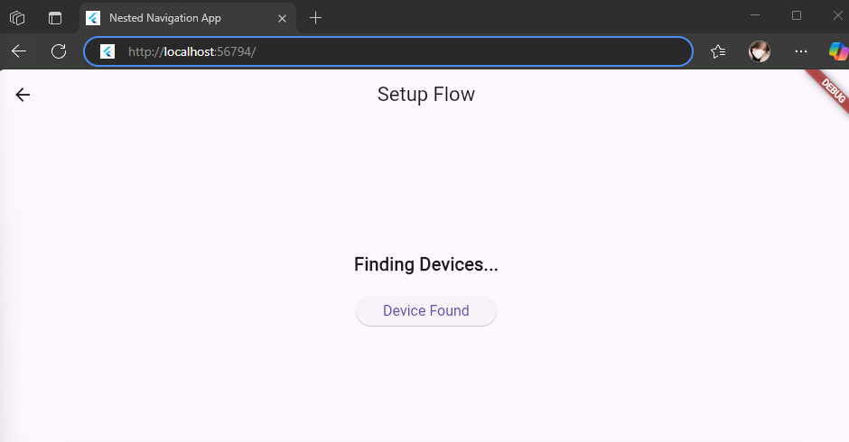
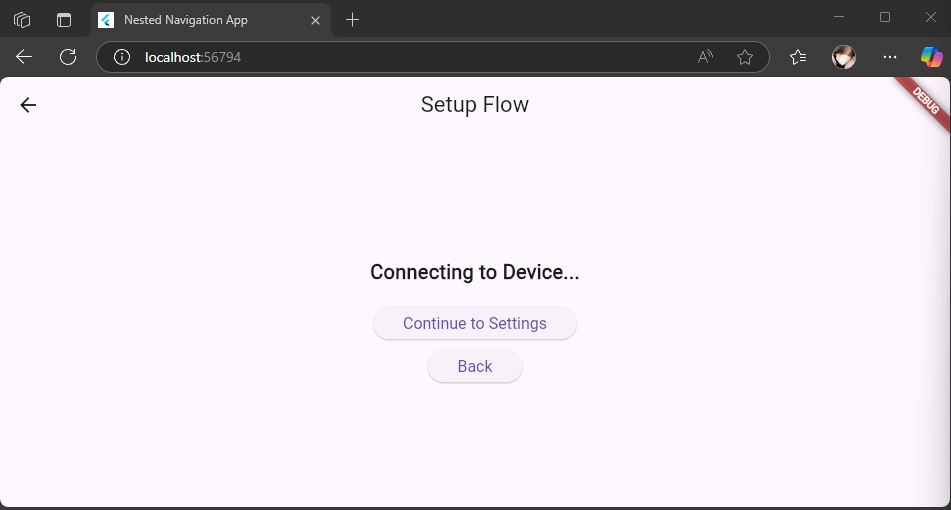
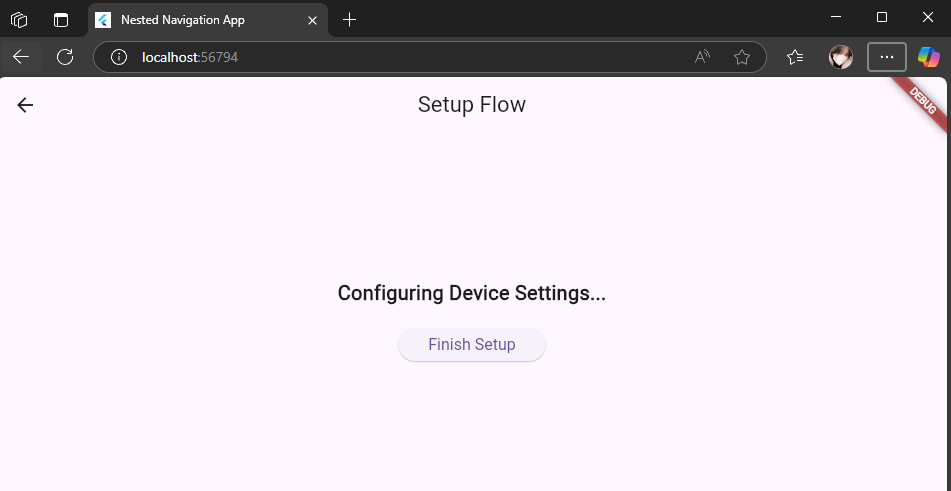

# Nested Navigation

A new Flutter project.

## Nama dan NPM

| Nama                  | NPM        |
|-----------------------|------------|
| Agil Deriansyah Hasan | 4522210125 |

---

## 🎯 Tujuan Praktikum
   1. Memahami konsep Nested Navigation di Flutter.
   2. Membangun alur navigasi di dalam sebuah halaman, tanpa mencampurkannya dengan navigasi global.
   3. Mengelola transisi layar secara modular, di mana satu bagian aplikasi memiliki alur navigasi internal sendiri.
   4. Mempelajari penggunaan Navigator dengan GlobalKey secara lokal di dalam halaman lain (Nested Navigator).

---

## 🧭 Jenis Navigasi yang Digunakan

| Jenis Navigasi                                                                    | Deskripsi                                                                      |
|-----------------------------------------------------------------------------------|--------------------------------------------------------------------------------|
| Navigator 1.0	                                                                    | Menggunakan Navigator.push dan pop secara eksplisit.                           |
| Nested Navigator                                                                  | 	Navigator yang tertanam di dalam halaman tertentu (bukan global MaterialApp). |
| MaterialPageRoute                                                                 | 	Untuk membuat transisi antar halaman dalam nested navigator.                  |
|  GlobalKey<NavigatorState>| 	Digunakan untuk mengontrol nested navigator dari luar.                        |

---

## 📱 Tangkapan Layar & Penjelasan Tampilan

### 1. HomeScreen
   1. Deskripsi:
      Halaman utama aplikasi. 
      Menampilkan tombol “Start Setup Flow” yang membuka SetupFlowScreen.

   2. Widget yang Berelasi:
      Scaffold: Struktur dasar halaman.
      AppBar: Judul halaman.
      ElevatedButton: Tombol navigasi ke halaman SetupFlowScreen.
      Navigator.push: Mengarahkan ke halaman baru (SetupFlowScreen).

---

### 2. SetupFlowScreen
   1. Deskripsi:
      Halaman yang memuat alur pengaturan bertingkat (multi-step).
      Menggunakan nested Navigator untuk menavigasi antar langkah (find → connect → settings).

   2. Widget yang Berelasi:
      Navigator: Navigator lokal di dalam halaman ini.
      GlobalKey<NavigatorState>: Mengontrol nested navigator dari luar Navigator widget.
      onGenerateRoute: Mendefinisikan rute dan tampilan berdasarkan nama rute (find_devices, connect_device, device_settings).

---

### 3. FindDevicesScreen
1. Deskripsi:
   Halaman pertama dari alur setup.
   Menampilkan teks "Finding Devices..." dan tombol "Device Found".

2. Widget yang Berelasi:
   Text: Menampilkan status.
   ElevatedButton: Memanggil onDeviceFound untuk navigasi ke connect_device.

---

### 4. ConnectDeviceScreen
1. Deskripsi:
   Halaman kedua dari alur setup.
   Menampilkan proses koneksi ke perangkat.
   Dua tombol: Lanjut ke pengaturan atau kembali ke langkah sebelumnya.

2. Widget yang Berelasi:
   Text: Menampilkan status koneksi.
   ElevatedButton: Memanggil onSetupComplete → navigasi ke device_settings.
   Navigator.pop: Kembali ke halaman sebelumnya (find_devices).

---

### 5. DeviceSettingsScreen
1. Deskripsi:
   Halaman terakhir dari alur setup.
   Menampilkan tombol “Finish Setup” yang menutup seluruh flow dan kembali ke HomeScreen.

2. Widget yang Berelasi:
   Text: Menampilkan status pengaturan.
   ElevatedButton: Memanggil onFinish, lalu Navigator.pop(context) untuk keluar dari SetupFlowScreen.

---

### Home Screen

### SetupFlowScreen

### FindDevicesScreen

### ConnectDeviceScreen

### DeviceSettingsScreen
